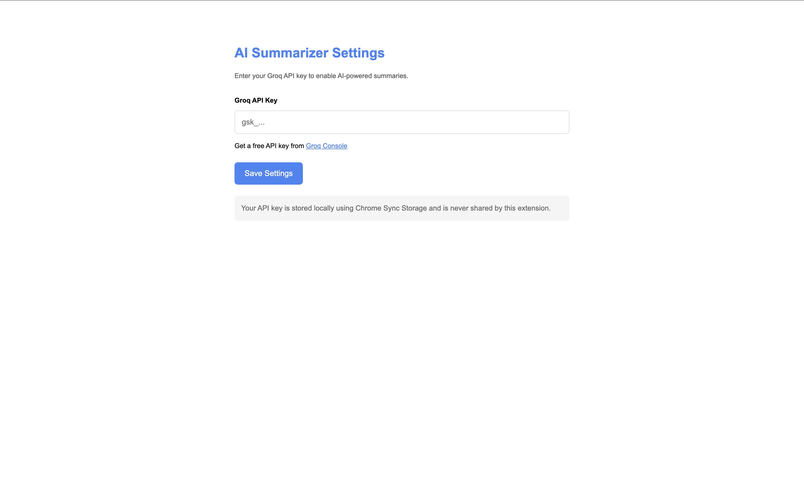
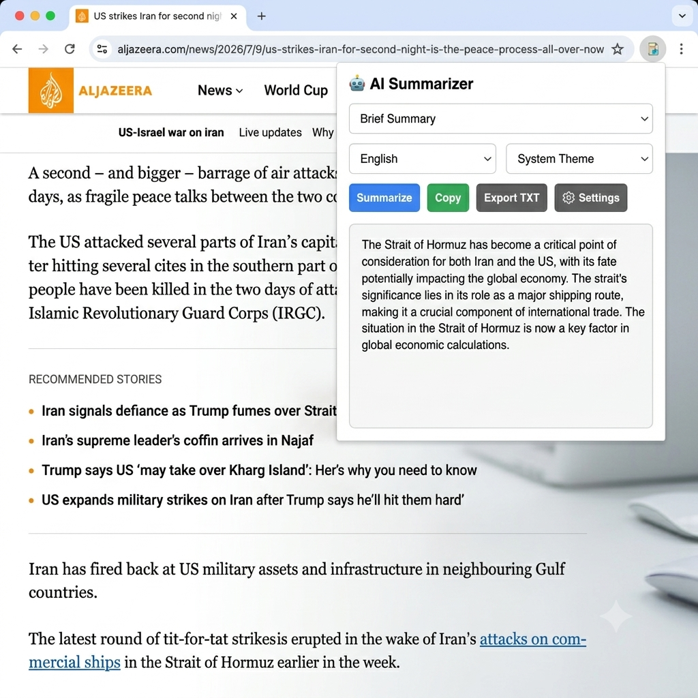

# AI Summarizer Chrome Extension 🤖

An AI-powered **Chrome Extension** built using **Manifest V3** that extracts webpage content and generates intelligent summaries using **Groq's Llama models**. Designed for productivity, the extension helps users quickly understand lengthy articles through concise, customizable summaries in multiple languages.

<a href="https://chromewebstore.google.com/detail/lmgihigkgdlnplkagbbnclbfnpacaojf" target="_blank">
  
</a>

<a href="https://github.com/chetan202022/AI-Summarizer-chrome-extension" target="_blank">
  
</a>

---

## 📸 Preview

| API Configuration | AI Summary |
|-------|------------|
|  |  |

---

## 📋 Table of Contents

- [Features](#features)
- [Tech Stack](#tech-stack)
- [Installation](#installation)
- [Configuration](#configuration)
- [Usage](#usage)
- [Architecture](#architecture)
- [Security & Privacy](#security--privacy)
- [Project Structure](#project-structure)
- [Contributing](#contributing)
- [Author](#author)

---

<h2 id="features">✨ Features</h2>

- **AI-Powered Summarization** using Groq's Llama models
- **Extract Content** directly from webpages
- **Three Summary Modes**
  - Brief Summary
  - Detailed Summary
  - Bullet-Point Summary
- **Multi-Language Support**
  - English
  - Hindi
  - Spanish
  - French
  - German
  - Japanese
- **Theme Support**
  - Light
  - Dark
  - System
- **Secure API Key Storage** using Chrome Sync Storage
- **One-Click Copy**
- **Export Summary as TXT**
- **Automatic First-Time Setup**
- **Manifest V3 Architecture**
- **Fast & Lightweight User Experience**

---

<h2 id="tech-stack">🛠️ Tech Stack</h2>

### Frontend

| Technology | Purpose |
|------------|---------|
| HTML5 | Extension UI |
| CSS3 | Styling |
| JavaScript (ES6+) | Application Logic |

### Chrome APIs

| Technology | Purpose |
|------------|---------|
| Manifest V3 | Extension Architecture |
| Content Scripts | Extract Webpage Content |
| Service Worker | Background Processing |
| Chrome Storage API | Secure Settings |
| Chrome Messaging API | Component Communication |

### AI

| Technology | Purpose |
|------------|---------|
| Groq API | AI Inference |
| Llama Models | Text Summarization |

---

<h2 id="installation">⚙️ Installation</h2>

### Install from Chrome Web Store

Install directly from:

**https://chromewebstore.google.com/detail/lmgihigkgdlnplkagbbnclbfnpacaojf**

---

### Run Locally

Clone the repository

```bash
git clone https://github.com/chetan202022/AI-Summarizer-chrome-extension.git

cd AI-Summarizer-chrome-extension
```

Open Chrome Extensions

```text
chrome://extensions
```

Enable

- Developer Mode

Click

- Load unpacked

Select the project folder.

---

<h2 id="configuration">🔧 Configuration</h2>

Generate a Groq API Key:

https://console.groq.com/keys

After installation:

1. Open the extension.
2. Enter your Groq API key.
3. Save.
4. You're ready to summarize webpages.

---

<h2 id="usage">🚀 Usage</h2>

1. Open any article.
2. Click the AI Summarizer extension.
3. Choose:
   - Summary Type
   - Output Language
4. Click **Summarize**.
5. View AI-generated summary.
6. Copy or Export the summary.

---

<h2 id="architecture">🏗️ Architecture</h2>

```text
User
      │
      ▼
Chrome Extension Popup
      │
      ▼
Content Script
      │
      ▼
Extract Webpage Content
      │
      ▼
Background Service Worker
      │
      ▼
Groq API
      │
      ▼
Llama Model
      │
      ▼
Generated Summary
      │
      ▼
Popup UI
```

---

<h2 id="security--privacy">🔒 Security & Privacy</h2>

- User API keys are securely stored using **Chrome Sync Storage**
- Users manage their own API credentials
- No browsing history is collected
- No summaries are stored on external servers
- Communication occurs directly with the Groq API

---

<h2 id="project-structure">📁 Project Structure</h2>

```text
AI-Summarizer-chrome-extension/
│
├── background.js
├── content.js
├── manifest.json
├── popup.html
├── popup.js
├── options.html
├── options.js
├── icons/
├── Screenshots/
└── README.md
```

---

<h2 id="contributing">🤝 Contributing</h2>

Contributions are welcome!

1. Fork the repository
2. Create a feature branch

```bash
git checkout -b feature/AmazingFeature
```

3. Commit your changes

```bash
git commit -m "Add AmazingFeature"
```

4. Push the branch

```bash
git push origin feature/AmazingFeature
```

5. Open a Pull Request

---

<h2 id="author">👨‍💻 Author</h2>

# Chetan Yadav

<p>

<a href="https://github.com/chetan202022">

</a>

<a href="https://linkedin.com/in/chetan-yadav-a21b0a289">

</a>

<a href="https://leetcode.com/u/Chetan__10/">

</a>

</p>

---

## ⭐ Support

If you found this project useful, please consider:

- ⭐ Starring the repository
- 🚀 Installing the extension
- 💬 Sharing your feedback
- 🍴 Forking the project

---